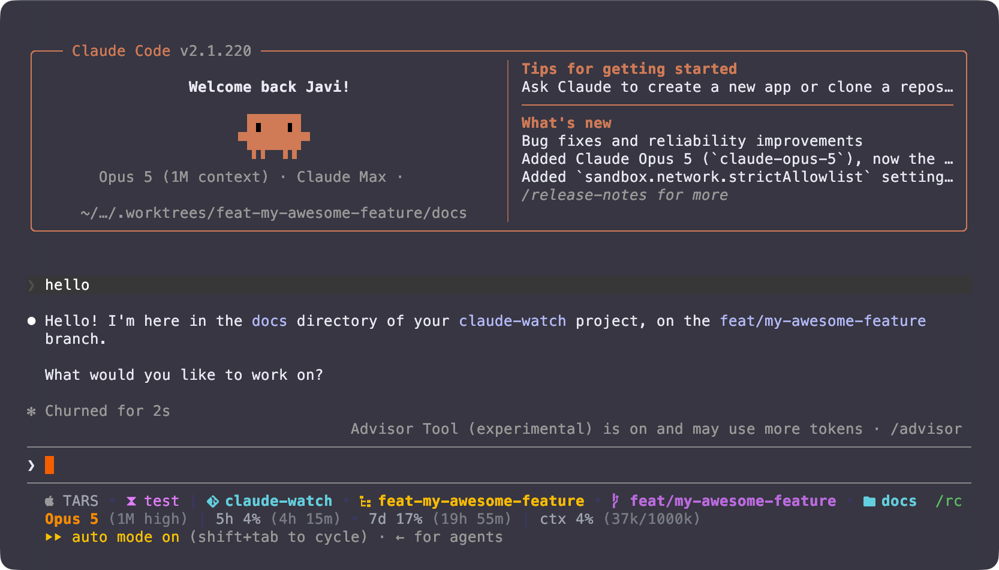

# claude-watch



## Installation

**1. Copy the script**

```sh
cp statusline-command.sh ~/.claude/statusline-command.sh
chmod +x ~/.claude/statusline-command.sh
```

**2. Merge `settings.json` into `~/.claude/settings.json`**

Add the `statusLine` block to your existing `~/.claude/settings.json`:

```json
"statusLine": {
   "type": "command",
   "command": "bash ~/.claude/statusline-command.sh"
}
```

If you have no `~/.claude/settings.json` yet, this creates one without touching an existing file:

```sh
[ -f ~/.claude/settings.json ] || cp settings.json ~/.claude/settings.json
```

Already running an older claude-watch? See [Upgrading](#upgrading-from-a-version-with-fetch-usagesh) below instead.

### Upgrading from a version with `fetch-usage.sh`

Usage stats now come from Claude Code itself, so the fetch script, its hooks and its caches are all gone. Remove the leftovers:

```sh
rm -f ~/.claude/fetch-usage.sh /tmp/.claude_usage_cache /tmp/.claude_token_cache
```

Then drop the `hooks` block that referenced `fetch-usage.sh` from `~/.claude/settings.json`.

## How it works

- **`statusline-command.sh`** — reads the JSON piped by Claude Code and renders two lines. Line 1: platform icon + hostname, the current `zmx` session (only when zmx is installed and `$ZMX_SESSION` is set), then repo, worktree, branch and subdirectory, each with its own Nerd Font glyph. Segments run outermost to innermost, and the optional ones sit at the tail so the leading `repo • worktree` keeps a stable shape:

  - **repo** — the main checkout's name, so it does not change as you move between worktrees or into subdirectories. Its glyph follows the SCM: git, subversion, or a generic marker for mercurial, jujutsu, fossil and bazaar, which have no logo in Nerd Fonts. Outside a repo the segment falls back to a plain folder glyph and the current directory's name.
  - **worktree** — `main` for the main checkout, otherwise the worktree's directory name. Git only.
  - **branch** — shown only when it differs from the worktree name, so the same word never appears twice. Falls back to the short commit hash on a detached HEAD. Git only.
  - **subdirectory** — the innermost component of the path below the repo root, omitted at the root. Only the last component, so deep paths do not stretch the line.

  Line 2: model and reasoning effort, usage stats and context window. Every segment is optional and separators collapse when one is missing.

  - **model** — the display name in bold, with a dim suffix for the reasoning effort and the 1M-context marker when either applies, e.g. `Opus 5 (1M high)`. The effort tracks mid-session `/effort` changes and is omitted on models without the parameter.
  - **usage** — the 5-hour and 7-day rate limit windows with a countdown to each reset. Both come straight from the JSON Claude Code pipes in: no token, no network call, no cache. The whole block is absent until the first API response of a session and for accounts without subscription rate limits, in which case the segments simply do not render.
- **`settings.json`** — wires up the statusline command. No hooks required.

## Dependencies

- `jq`
- `git` (optional, for branch/worktree display)
- `zmx` (optional, for session name display)
- [Nerd Fonts](https://www.nerdfonts.com/) (for the platform, repo, worktree, branch and folder icons)

Other SCMs are detected by their marker directory (`.hg`, `.svn`, `.jj`, `.fslckout`, `.bzr`), so nothing needs to be installed for the repo segment to appear.

Works on macOS and Linux.
